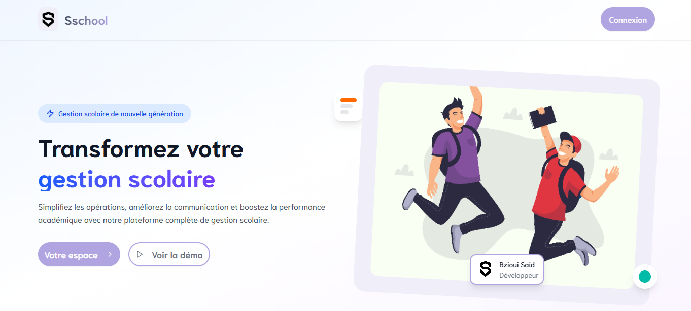
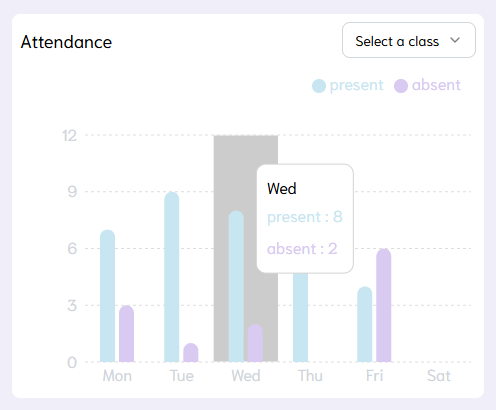
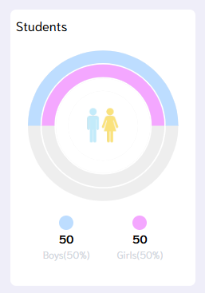
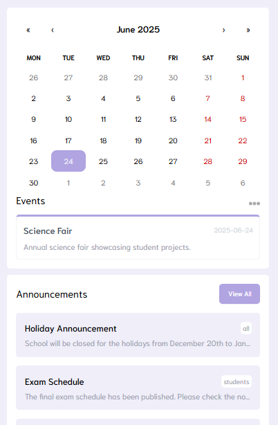

<h1 align="center">🎓 Gestion de Scolarité</h1>
<p align="center">
  A complete school management system built with <strong>Laravel</strong> & <strong>ReactJS</strong>.
</p>

<p align="center">
  
</p>

---

## 📌 Overview

**Gestion de Scolarité** is a web-based application that simplifies student management, class scheduling, attendance tracking, and more.  
It is designed for educational institutions to manage daily academic operations effectively.

---

## 🚀 Features

- ✅ Record and visualize student attendance
- 📅 Weekly schedule with calendar integration
- 📊 Dynamic charts for absences and presence
- 👨‍🏫 Teacher & subject management
- 🧑‍🎓 Personalized student dashboards
- 🔐 Authentication & role-based access

---

## 🛠 Tech Stack

### Frontend
- ⚛️ ReactJS
- 💨 Tailwind CSS
- 🧩 Shadcn UI
- 📆 React Big Calendar
- 📡 Axios

### Backend
- 🐘 Laravel (PHP)
- 🛢 MySQL
- 🔐 Laravel Sanctum (auth)

---

## 🖼 Screenshots

| Attendance Chart | Gender Chart | Events View |
|------------------|----------------|-------------------|
|  |  |  |

---

## 🧑‍💻 Installation Guide

### 📁 Clone the repo

```bash
git clone https://github.com/your-username/gestion-scolarite.git
cd gestion-scolarite
